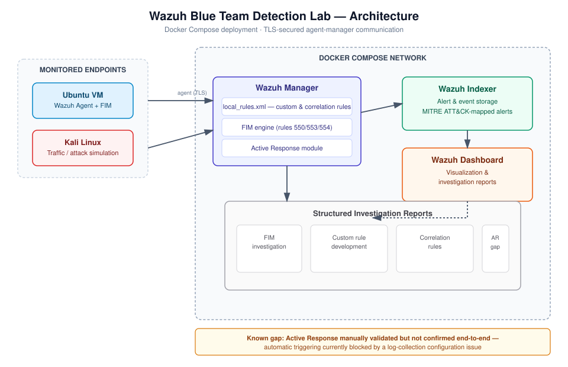

# Ananthan D

**Blue Team / SOC Analyst (Entry-Level) — SIEM Deployment & Detection Engineering**

B.Tech Information Technology (2026) building hands-on security engineering skills through self-directed home labs rather than coursework alone. Focused on SIEM deployment, detection rule development, and log-based investigation.

---

## About

- **Education:** B.Tech, Information Technology — University College of Engineering, Kariavattom (Nov 2022 – Jul 2026)
- **Current focus:** Wazuh SIEM/XDR deployment, custom detection rule development, log correlation, MITRE ATT&CK mapping
- **Target roles:** SOC Analyst L1, Blue Team Analyst, Cybersecurity Analyst
- **Approach:** Learn by building — every lab below is documented as a structured investigation report (objective, methodology, evidence, findings), not just a tutorial follow-along.

---

## Technical Skills

| Category | Skills |
|---|---|
| **SIEM / Detection** | Wazuh SIEM/XDR, custom rule development (`local_rules.xml`), correlation rules (`if_matched_sid`, frequency/timeframe), File Integrity Monitoring, MITRE ATT&CK mapping |
| **Security Tools** | Nmap, Wireshark, Burp Suite *(via PortSwigger Web Security Academy)* |
| **Operating Systems** | Linux (Ubuntu, Kali Linux), Windows fundamentals |
| **Networking** | TCP/IP, DNS, packet analysis, network reconnaissance |
| **Programming** | Python, Bash, C |
| **Infrastructure** | Docker, Docker Compose, VMware Workstation, Git |

---

## Certifications

- **Microsoft** — Cybersecurity Threat Vectors and Mitigation (Coursera, July 2026)
- **IBM** — Introduction to Cybersecurity Essentials
- **TryHackMe** — Pre Security Learning Path

---

## Projects

# [Wazuh Blue Team Detection Lab](https://github.com/ananthancyber/wazuh-blue-team-detection-lab)
Containerized Wazuh 4.14.6 SIEM/XDR stack (Manager, Indexer, Dashboard) deployed via Docker Compose with TLS and agent connectivity validation.

- Custom detection rules in `local_rules.xml`, including a correlation rule (`if_matched_sid`, frequency/timeframe) to cut alert volume from repeated login events
- File Integrity Monitoring with a structured report on rule IDs 550/553/554 and checksum change analysis
- Active Response framework investigated and manually validated; documented findings on why automatic triggering is currently blocked by a log-collection gap
- MITRE ATT&CK coverage matrix mapping detections to techniques only where a genuine link exists

**Stack:** Docker, Docker Compose, Wazuh 4.14.6, Kali Linux, VMware Workstation
**Status:** Active development
## Architecture

# AI SOC Log Triage Assistant

AI-assisted triage tool for Wazuh SIEM alerts, using local Retrieval-Augmented Generation so security data never leaves the machine. Built on real alerts generated by the Wazuh Blue Team Detection Lab rather than synthetic sample data.

- RAG pipeline: FAISS semantic search over a local knowledge base, grounding every LLM response in retrieved reference material with visible similarity scores (not a black box)
- Local LLM inference via Ollama (Qwen 2.5) with local embeddings (nomic-embed-text) — no cloud API calls
- Python parser handling multiple Wazuh alert JSON/JSONL structures, with MITRE ATT&CK technique suggestion constrained to explicit "insufficient evidence" fallback when unsupported
- Streamlit dashboard: upload alerts, trigger analysis, view and download structured Markdown investigation reports
- Next: automated test coverage, Docker packaging, live Wazuh manager integration

**Stack:** Python, Wazuh SIEM alert format, Ollama, FAISS, Streamlit

**Status:** Functional end-to-end pipeline — refining test coverage and deployment packaging

### [SOC Home Lab — Linux Log & SSH Investigation](https://github.com/ananthancyber/SOC-Home-Lab)
Two-VM lab (Ubuntu target, Kali Linux attacker) over a NAT network for log-based investigation practice.

- Traced SSH authentication activity using `journalctl`, documenting login patterns with commands and screenshots
- Ran host discovery and port scans with Nmap; captured protocol-level traffic with Wireshark

**Stack:** VMware Workstation, Ubuntu, Kali Linux, Nmap, Wireshark, journalctl
**Status:** Complete

### Network Port Scanner
TCP port scanner written from scratch in Python using raw socket programming, validated against Nmap output on the same lab targets for accuracy.

**Stack:** Python, socket programming, TCP/IP
**Status:** Complete

---

## Lab Walkthroughs

- **[Hack The Box](https://github.com/ananthancyber/Hack-the-box-lab)** — enumeration methodologies, initial access, service enumeration, file transfer techniques
- **PortSwigger Web Security Academy** — OWASP Top 10 labs, including injection and access control vulnerabilities

---

## Currently Building

- AI SOC Log Triage Assistant — prompt engineering and automated incident summaries on top of real Wazuh alert data
- Closing the log-collection gap blocking Active Response automation in the Wazuh lab
- Planning a VAPT pipeline that reuses log data generated by the Wazuh lab

---

## Technical Notes

Detailed lab methodology and investigation write-ups: [Notion](https://app.notion.com/p/Cybersecurity-Foundation-3449d19d341d80fcaeb0d7e0875b9fb4?source=copy_link)

---

## Connect

[LinkedIn](https://www.linkedin.com/in/ananthan-d-ab295321b) · [GitHub](https://github.com/ananthancyber) · [Email](mailto:ananthan.cyber@gmail.com)
